****************************************
Appendix A: Ringdown Example Application
****************************************

Introduction
------------

A power system is a massive system that can be perturbed by load
changes, generator trips, faults or networks changes. Power system
oscillations are common issues. To mitigate oscillations, oscillations
should be identified and studied in a timely manner. There are two
separate approaches to identify power system oscillations. The first
approach is based on detailed dynamic model of the system such as
eigenvalue analysis or state space modeling. The second approach is
based on measurements to identify oscillation modes.

With phasor measurement unit (PMU) data collected, electromechanical
oscillation modes can be identified from the synchrophasor measurements.
Several measurement-based system identification methods have been
proposed for PMU data-based estimation. In this documentation, we will
focus on the Prony analysis. It is one of the most common
measurement-based identification techniques to identify oscillatory
modes, and was studied and developed by the Pacific Northwest National
Laboratory (PNNL) for several years [1]_, [2]_. The following application is based
on the Dynamic System Identification (DSI) toolbox that the PNNL have
implemented.

*Fundamentals of Prony analysis*

Consider a Linear-Time Invariant (LTI) system with the initial state of
:math:`x(t_{0}) = x_{0}` at the time :math:`t_{0}`, if the input is
removed from the system, the dynamic system model can be represented as:

.. math:: \dot{x(}t) = A\ x(t)

.. math:: y(t) = C\ x(t)

where :math:`\text{y} \in \mathbb{\text{R}}` is defined as the
output of the system, :math:`\text{x } \in \ \mathbb{R}^{n}` is the
state of the system, :math:`\text{A} \in \ \mathbb{R}^{\text{nxn}}`
and :math:`\text{C} \in \ \mathbb{R}^{1xn}` are system matrices. The
order of the system is defined by *n*. If the :math:`\lambda_{i}`,
:math:`p_{i}`, and :math:`q_{i}` are the i-th eigenvalues, right
eigenvectors, and left eigenvectors of :math:`\text{n x n}` matrix A,
respectively, the system can be solved as:

.. math:: x\left( t \right) = \sum_{i = 1}^{n}{\left( {q_{i}}^{\tau}\ x_{0} \right)p_{i}e^{\lambda_{i}t}}\qquad \Rightarrow \qquad y\left( t \right) = \sum_{i = 1}^{n}{\text{C}\left( {q_{i}}^{\tau}\ x_{0} \right)p_{i}e^{\lambda_{i}t}}

Prony analysis directly estimates the parameters for the exponential
terms of :math:`y(t)` by defining a fitting function in a basic form of:

.. math:: \ \hat{y}\left( t \right) = \sum_{i = 1}^{n}{B_{i}\ e^{\sigma_{i}t}}\cos{(2\pi f_{i}t + \varphi_{i})}

In other words, the output of the system is projected onto a signal
consisting of a set of damped oscillations. The way in which this
projection is carried out varies depending on the algorithm used. But,
most of them contemplate accumulating a certain amount of samples and
generating a linear prediction model, from which the roots of the
characteristic polynomial of the system can be estimated.

Example ringdown application analysis
-------------------------------------

Getting started
~~~~~~~~~~~~~~~

If this is the first use of the PARTF test framework, be sure to follow
the first time setup instructions in :ref:`Quick Start <quickStart>`

Open the PARTF *main.vi*. Select the Ringdown Event Type and the
Ringdown from Application indicators in the front panel then press the
``Add Bus`` button. The number of buses is going to change to 1. After that
you can customize your event as you prefer. Consider the configuration
of Figure 1. An alternative method to set up the system is to press
the browse button next to the Test File control and select the
*Test\\Ringdown\\Ringdown.tst* file, then press the ``Open`` button next to
the ``Test File`` control.

|image0|

Figure 1: Front panel of the main.vi with the configuration for a simple
rigndown test.

As you can observe from Figure 1 the main framework is configured to
create a ringdown event with a ``Start Time`` set to 0 seconds, ``End Time`` equal to 5 (seconds). The PMU
``Reporting Rate`` is set to 60 frames per second with a ``Nominal Frequency`` 
of 60 Hz, If a Model PMU is used for the Sensor Impairment, a sampling
frequency ( ``FSamp`` )equal to 960 Hz is used, if the impairment is not based on a
model PMU, the sampling frequency is ignored. The event default
parameters defined in the *RingdownEvtPlugin.ini* file are used [note1]_. The
``Sensor Impairment Type`` is changed to C37.118.1 PMU DSP Model which
basically is going to simulate the behavior of the M class PMU defined
by the IEEE 2011 standard. If changes are made to the default
configuration, the Bus must be updated with the new values: press the
``Update Bus`` button to update the bus. If you desire to save the setup
to a test file, press the ``Save`` button and select a new test file
name or overwrite the selected one.

If a test were to be run now, all the new information would be created,
but you would not see any results. Results are viewed by using ``Visualization`` applications. One or more visualization
application can be running at the same time. To view the available
visualization applications and launch one or more of them, press the
``Visualization`` button [note2]_.

|image1|

Figure 2: Visualization App selection dialog

Because the Ringdown application is active, The *VisualizeAppRingdown.vi*
should pre-selected. Press ``Run App`` and. a new VI emerges on the
screen. Visualization apps allow the user to observe ooperation of the PARTF while tests are running.
Without a visualization app, the tests run but there is no visual confirmation of the running tests or when they conclude.
Press ``the Single Run`` button in the PARTF frontpanel to run a single test.

|image2|

Figure 3: Front panel of the visualize.vi for a typical rigndown event .

The main features of the event are displayed on the visualization app, as you can
see in figure 3. The user can observe the difference between the oscillatory
modes of the input signal and the estimated ones by the Prony method in
the s-plane [note3]_. Furthermore, a Prony estimate signal is created form
the modes and is compared with the input signal. The error signal is
showing the difference between the two of them.

Simple Monte Carlo test example
~~~~~~~~~~~~~~~~~~~~~~~~~~~~~~~

The idea of this example is to understand how to use a python script to
perform Monte Carlo testing on an application and how the PMU input
signals are created. So, with the main program still running, and with
the configuration set in the example above, press the ``Browse`` button
in the Monte Carlo Script control choose the
*Scripts\\Ringdown\\GetRingdownEvtSignal.py* script then press the ``Monte
Carlo`` button. A windows command dialog will open and run the script
then close again. If you want the window to remain open after the test
(for example for debugging a script) then click the ``Leave Script
Window Open for Debugging`` checkbox. Later you can close any of these
windows left open after the test has run. Also note that closing this
command window during a test will have the effect of aborting the test.
An error message will appear in the PARTF application, but you can abort
the test without needing to close the PARTF framework.

As a result of running the *GetRingdownEvtSignal.py* script, a *.mat* and a
*.pkl* files have been created your *My Documents\\PARTF\\Output* directory.
In your *My Documents\\PARTF\\Scripts\\Ringdown\\* directory, you will
find a *PlotRingdownSignals.m* file which, when run, will create Figures 4
through 6

|image3|

Figure 4: Matlab plot of the simulated voltage generated by the event.

If you look into the python code for *GetRingdownEvtSignal.py*, you can
figure out that python is asking Labview for the event parameters and
reports. For each one of the reports the Matlab file extracts the
voltage, current, frequency and ROCOF and plots it. for details of the ringdown even, see the RngEvt.m_ description, the assumption that
the voltage magnitude stays as a constant and that the rate of change of
the current phase is defined by the Pi event parameter are corroborated.
More information about PARTF test automation can be found
:ref:`here <testAutomation>`.

|image4|

Figure 5: Matlab plot of the simulated current generated by the event.

Figure 6 shows the frequency and ROCOF signals. As you can
see it contains different kinds of oscillations coming from the equation
of the time derivative of the voltage phase.

|image5|

Figure 6: Matlab plot of the simulated frequency and ROCOF.

Creating a Monte Carlo analysis
~~~~~~~~~~~~~~~~~~~~~~~~~~~~~~~

Go back to the main.vi and set the ``End Time`` equal to 10. After doing
that you should remember that the ``Update Bus`` button needs to be
pressed. Then, choose the *RingdownMonteCarlo.py* script to start running a
sequence of events, where the only aleatory variable is the signal noise
(note that the last row of the ``Event Parameters`` has standard
deviation of noise for the M1 frequency component equal to 10e-6). At
line 12 of this script the user can select the total number of events or
iterations to be performed. After the last iteration is concluded, and
if you leave the script window open, you should see the total time that
this kind of analysis requires.

|image6|

Figure 7: Set of estimated active power signals with its respective
error.

The next step is to go to *My Documents\\PARTF\\Scripts\\Ringdown* again
and run the *PlotRingdownNoiseTest.m* file in Matlab. This file is going to perform
a test to validate the application itself. Two thresholds are defined.
The first one is defined in the error signal between the active power
and the estimated one by the Prony method as you can observe from Figure
7. The error signal cannot exceed a specific value defined by the Matlab
variable ``error\_thres``. If it does, that indicates the application is not
working as expected and we stipulate that it has a failure, as you can
see in Figure 7.

|image7|

The second threshold takes place in the s plane. As you can observe from
Figure 8 the first four modes with the biggest amplitudes are plotted.
As you can notice the app is not working well, it looks like another
mode is interfering with the result because there are a lot of points
concentrated around the point {-2.5,0.3}.

|image8|

Figure 9: S plane with the oscillatory modes of the Monte Carlo
analysis.

It is important to highlight that these results are different that the
ones displayed by the Labview visualization tool, because in Figures 6
and 8 all the modes estimated by the Prony method are being used. In the
*visualizeRingdown.vi* only a subgroup of visible modes is used to create the
Prony estimated signal.

So, the question here is... how can we make improve the situation? Solution: Go back
to the PARTF frontpanel and click on ``Configure Application`` then change the
``Linear Prediction Algorithm`` from *total least squares via SVD* to *SVD with
possible rank reduction* and repeat the ``Monte Carlo`` analysis. The Figures
10 through 12 show the new results. From the last figure, it is more clear that a
the thresholds in the s plane are ellipses where the radius are defined
by the Matlab ``freq\_std`` and ``damp\_std`` respectively. Although the
distribution of the output noise is unknown, the ellipses are considered
to be a good selection criterion.

|image9|

Figure 10: Command Window message, using SVD with possible rank
reduction.

|image10|

Figure 11: Set of estimated active power signals with its respective
error.

The user will be able to evaluate different scenarios and corroborate
that for this application the configuration of the linear predictor
model is more crucial than the error coming from a PMU that is operating
under the parameters of quality of the C37.118.1 IEEE standard.

|image11|

Figure 12: S plane with the oscillatory modes of the Monte Carlo
analysis.

Summary of Labview Vis
----------------------

EventPlugins.lvlib: RingdownEvtPlugin.lvclass
~~~~~~~~~~~~~~~~~~~~~~~~~~~~~~~~~~~~~~~~~~~~~

Parent class: EventPluginBaseClass.lvclass

Overridden Vis: GetEvtReports.vi, GetEvtSignal.vi

RingdownEvtPlugin.ctl: Empty, the parent class control is used.

1. | |image12|\ ***GetEvtReports.vi*** Icon:
   | Inputs: RingdownEvtPlugin object

   -  ClEvtConfig: T0, F0, bPosSeq

   -  dblTimeArray

   -  dblEvtParams

   -  BusNumber

      Outputs: RingdownEvtPlugin object

   -  Timestamp

   -  Synx

   -  Freq

   -  ROCOF

      | Description: Creates all the synchrophasors included in each one
        of the reports based on the event
      | configuration and the event parameters. Contains a Matlab script
        block where Rngevt.m
      | is called. See Rngevt.m for more details.

1. | |image13|\ ***GetEvtSignal.vi*** Icon:
   | Inputs: RingdownEvtPlugin object

   -  ClEvtConfig: FSamp

   -  dblTimeArray

   -  dblEvtParams

      Output: RingdownEvtPlugin object

   -  Signal

      | Description: Creates the voltage and the current waveforms.
        Contains a Matlab script block where
      | genRngSignal.m is called See genRngSignal.m for more details.

2. | |image14|\ ***RgnEvtParamsErrors.vi*** Icon:
   | Empty. Reserved for future use.

AppPlugins.lvlib: RingdownPlugin.lvclass 
~~~~~~~~~~~~~~~~~~~~~~~~~~~~~~~~~~~~~~~~~

| |image15|\ Parent class: AppPluginsBase.lvclass
| Overridden Vis: AppConfig.vi, AppCOnfigTypeToXML.vi,
  AppConfigXMLToType.vi, GetAppOutput.vi, WriteEvtCOnfig.vi
| RingdownEvtPlugin.ctl:

1. | |image16|\ ***AppConfig.vi*** Icon:
   | Inputs: RingdownEvtPlugin object

   -  RingdownConfig: PosSeq

      PronyConfiguration.ctl

   -  Lpmcon

   -  Lpacon

   -  Fbcon

   -  LPOrd

   -  UTrimFreq

   -  ResTrim

      Outputs: RingdownEvtPlugin object

   -  | RingdownConfig: Config.Lpmcon, Config.Lpacon, Config.Fbcon,
        Config.Lpocon,
      | Config.Ftrimh, Config.Ftriml, Config.Trimre, Window.StOffset,
        Window.EndOffset, Window.Length, V index, I index

      | Description: The Configure Application button of the front panel
        lunches this vi which saves all the
      | application configuration that the user can modify. The
        significance of the variables
      | involved is described in the prgv2\_6.m Matlab function.

2. | |image17|\ ***WriteEvtConfig.vi*** Icon:
   | Inputs: RingdownEvtPlugin object

   -  RingdownConfig: V index

      EventConfiguration.ctl

   -  PosSeq

      Outputs: RingdownEvtPlugin object

   -  RingdownConfig: I index

   -  RingdownConfig: PosSeq

      | Description: Based on the PosSeq Boolean value, the I index is
        set. This index allows the
      | GetAppOutput.vi to know where to look for the current
        synchrophasors values.

3. | |image18|\ ***GetAppOutput.vi*** Icon:
   | Inputs: RingdownEvtPlugin object

   -  RingdownConfig

   -  clEvtReportArray

      Outputs: RingdownEvtPlugin object

   -  AppOutputData: ReportingTime, FramesPerSecond, InputSignal,
      DataSiza, PronyEstimate, RingdownParameters: Amplitude, Damping,
      Frequency, Phase.

      | Description: This vi contains a Matlab script block which calls
        the GetRngOutput.m file. Basically, it
      | process the event report array generated by the GetEvtReports.vi
        or GetEvtSignal.vi, with the addition of the PMU impairs, in
        order to estimate all the oscillatory modes, using the
        configuration specified with the AppConfig.vi or the default
        values. From the oscillatory modes, a prony estimate signal is
        created also.

4. | |image19|\ ***Synx2Power.vi*** Icon:
   | Inputs: RingdownEvtPlugin object

   -  clEvtReportArray

   -  RingdownConfig

      Output: Active Power

      Reactive Power

      | Description: From the syncrhopasors reports we select phase A to
        calculate the power flow through
      | the branch where the PMU is connected.

5. | |image20|\ ***WindowParams.vi*** Icon:
   | Inputs: RingdownEvtPlugin object

   -  clEvtReportArray

   -  RingdownConfig

      Output: RingdownEvtPlugin object

   -  RingdownConfig

      | Description: Using the difference between two consecutive
        timestamps, the window start offset
      | index and end index are calculated form the the Window.StOffset
        and
      | Window.EndOffset time values.

6. | |image21|\ ***ClusterToArray.vi*** Icon:
   | Inputs: RingdownEvtPlugin object

   -  RingdownConfig

      Output: RingdownInput

      | Description: The Matlab script block in the GetAppOutput.vi does
        not support clusters as an input, so
      | all the rigndown configuration is converted into an array.

Matlab Function descriptions
----------------------------

.. _Rngevt:

Rngevt.m
~~~~~~~~

1. .. rubric:: Rngevt.m
      :name: rngevt.m

   1. | Purpose:
      | To create the ringdown event reports. Each one of this reports
        contains a set of voltage and current synchrophasors. The time
        between two consecutive reports is defined by the reporting
        rate.

   2. | Description/Comments:
      | If the signal parameters define a mode above the Nyquist
        frequency, this mode will not keep in mind unless the internal
        variable nyquist\_ena is settled to 0.

   3. | Inputs:
      | *T0*: Initial time (offset)
      | *F0*: Nominal frequency
      | *time*: Array of times. It starts at the Start Time, and
        finishes at the End Time, with regular
      | intervals defined by the reporting rate.
      | *signalparams*: Matrix of doubles containing the Event
        Parameters specified in the front panel. The most
      | of them correspond to the prony\_reconstruction.m input. The
        last three rows define the
      | module voltage value (V), the rate of change of the phase for
        the current phasor (:math:`\gamma_{i}`) and
      | the AWG noises added in the module and the phase of the voltage
        and current phasors.
      | *bPosSeq*: Boolean control which determines if the function adds
        the positive sequence to the output data.

   4. Outputs:

      *timestamp*: Idem time but the T0 was included.

      *synx*: Matrix of complex containing the 3-phase voltages, the
      3-phase currents and possibly the positive sequence
      synchrophasors.

      *freq*: Array of doubles including the frequency of the system
      extracted from the voltage phase.

      *ROCOF*: Array of doubles including the rate of change of
      frequency.

   5. | Algorithm
      | Based on the values ​​provided by the *signalparams* input, and
        using the prony\_reconstruction.m function, the active power
        signal and the reactive power signal can be calculated as
        follows:

.. math:: {P\left( t \right) = \sum_{i = 1}^{n}{A_{i}\ e^{\sigma_{\text{pi}}t}}\cos{(2\pi f_{\text{pi}}t + \varphi_{\text{pi}})}\backslash n}\backslash n{Q\left( t \right) = \sum_{i = 1}^{n}{B_{i}\ e^{\sigma_{\text{qi}}t}}\cos{(2\pi f_{\text{qi}}t + \varphi_{\text{qi}})}\backslash n}\backslash n

.. math:: S = P + jQ = \sqrt{3}\ \mathbf{V}\ \mathbf{I}^{\mathbf{*}}

***V*** and ***I*** represent the voltage and current phasors
respectively. Decomposing into module and phase:

.. math:: {S = \sqrt{3}\text{\ V}e^{j\theta_{v}}\text{\ I}e^{- j\theta_{i}}\backslash n}\backslash n

.. math:: Ie^{j\theta_{v}} = \frac{Se^{j\theta_{i}}}{\sqrt{3\ }\text{V\ }}

Now the voltage and the current phasors are created with the addition of
the AWGN stipulated in the *signalparmas* matrix. At last the frequency
and ROCOF are calculated as follows:

.. math:: f = f_{0} + \frac{1}{2\pi}\frac{d\theta_{v}}{\text{dt}}

Where,

.. math:: \theta_{v} = arctan\left( \frac{Q}{P} \right) + \theta_{i}

So

.. math:: f = f_{0} + \frac{1}{2\pi}\ \left\lbrack \frac{1}{\left( \frac{Q}{P} \right)^{2} + 1}\left( \frac{\dot{Q}P - Q\dot{P}}{P^{2}} \right) + \gamma_{i} \right\rbrack\backslash n

If the following terms are defined,

.. math:: H_{1} = \frac{1}{\left( \frac{Q}{P} \right)^{2} + 1}\text{\ \ \ \ \ \ \ \ \ \ \ \ \ \ \ \ \ \ \ \ \ }H_{2} = \left( \frac{\dot{Q}P - Q\dot{P}}{P^{2}} \right)\backslash n

Then,

.. math:: ROCOF = \frac{\text{df}}{\text{dt}} = \frac{1}{2\pi}\left( \dot{H_{1}}H_{2} + H_{1}\dot{H_{2}} \right)

Again, for simplicity reasons the time derivatives of
:math:`P`,\ :math:`\text{\ Q}`, :math:`H_{1}` and :math:`H_{2}` are not
displayed.

.. math:: \backslash n

.. _genRngSignal:

genRngSignal.m
~~~~~~~~~~~~~~

1. .. rubric:: genRngSignal.m
      :name: genrngsignal.m

   1. Purpose: To create the ringdown event signals. These waveforms
      contain a set of voltage and current values at a rate equal to
      *Fsamp* (sampling frequency).

   2. Description/Comments:

      This function is very similar to the Rngevnt.m with the exception
      that neither the frequency nor the ROCOF and positive sequence are
      calculated. Finally, the output is not a phasor, it is a real
      waveform.

   3. | Inputs
      | *time*: Array of times. It starts at the Start Time less two
        times the filter order, and finishes at the End Time plus two
        times the filter order, with regular intervals defined by the
      | sampling frequency.
      | *FSamp*: Sampling frequency
      | signalparams: Matrix of doubles containing the Event Parameters
        specified in the front panel.

   4. | Outputs
      | *Signal*: Matrix of doubles containing the 3-phase voltages and
        the 3-phase currents signals.

2. .. rubric:: prony\_reconstruction.m
      :name: prony_reconstruction.m

   1. Purpose: To create a time variant signal from a Prony
      decomposition.

   2. | Description/Comments:
      | It is assumed that the time goes from zero until the time
        defined by the total length of the signal and the time interval
        between samples.

   3. Inputs

      | *amp*: Array of doubles with the amplitudes values for each one
        of the modes (:math:`A_{i}`).
      | *phase*: Array of doubles with the phases values for each one of
        the modes (:math:`\varphi_{i}`).

      | *freq*: Array of doubles with the frequencies values for each
        one of the modes (:math:`f_{i}`).
      | *damp*: Array of doubles with the dampings values for each one
        of the modes (:math:`\sigma_{i}`).
      | *delta\_t*: The interval of time between samples.
      | *n\_leng*: Total length of the signal

   4. | Outputs
      | *prony\_estimate*: Vector of doubles with the real signal
        created from the coefficients passed as an input (:math:`y`).

.. math:: y\left( t \right) = \sum_{i = 1}^{n}{A_{i}\ e^{\sigma_{i}t}}\cos{(2\pi f_{i}t + \varphi_{i})}

1. .. rubric:: GetRngOutput
      :name: getrngoutput

   1. Purpose: To set all the variables according to the needs of the
      DSI toolbox and run it.

   2. Description/Comments:

   3. Inputs

      | *data\_in*: Array of doubles with active power waveform.
      | *xcon*: Array of doubles with the configuration needed for the
        DSI toolbox.

      *wcon*: Array of integers with the window configuration.

   4. | Outputs
      | *data\_values*: Array of doubles with the real signal created
        from the coefficients passed as an input (:math:`y`).

      *data\_len*: Total length of the data processed

      *dft*: Interval of time between samples

      *amp*: Array of doubles containing the amplitudes of the
      oscillatory modes.

      *damp*: Array of doubles containing the dampings of the
      oscillatory modes.

      *freq*: Array of doubles containing the frequencies of the
      oscillatory modes.

      *phase*: Array of doubles containing the phases of the oscillatory
      modes.

      *damp\_ratio*: Array of doubles with the damping ratios of each
      mode. The damping ration is defined as folows:

.. math:: \eta = \sqrt{{f_{i}}^{2} + {\sigma_{i}}^{2}}

| *prony\_estimate*: Array of doubles with the signal estimated from the
  amp, damp, freq and phase
| variables.

*comp\_time*: Computing time

*wrnerr*: Warning flag. It indicates if the toolbox opted for aborting
the prony calculation. The user will receive a null output.

1. .. rubric:: prgv2\_6
      :name: prgv2_6

   1. Purpose: Defines the sequence of events that the toolbox needs to
      run the Prony method.

   2. Description/Comments:

      It is a modified version of the original one. Some object-oriented
      variables, which handle error messages were deleted, as well as

   3. Inputs

      | sigdat: Vector of doubles with the input signal. The active
        power is selected.
      | *tstep*: The interval of time between the PMU reports.

      | *shftnnft*: A vector with two components. The first one
        containing a shift variable with the number
      | of points to skip in each column before performing the Prony
        analysis, and second
      | containing the data length.

      *impulses*: Input pulse matrix. First column is the delay value
      and the second coulmn has the amplitude value.

      *known\_modes:* Known mode matrix. First column is damping
      coefficients and second is mode frequencies (in rad/sec).

      *xcon:* Control vector. This is both an input and an output.

      | Variable: modes, lpocon, pircon, dmodes, lpmcon, lpacon, fbcon,
        ordcon, trimre, ftrimh,
      | ftriml

      | *modes*: Number of modes in addition to those entered in knwmod
        to calculate.
      | If modes == 0 just calculate residues for knwmod.

      If modes < 0 automatically determine number of additional modes to
      calculate.

      *scalmode*: Reserved for future use.

      *lpocon*: Order of linear prediction.

      *pircon*: Rank of pseudo-inverse in linear prediction.

      *dmodes*: Number of modes identified in linear prediction.

      *lpmcon*: Linear prediction method.

      *lpacon*: Linear prediction algorithm.

      *fbcon*: Forward/backward linear prediction.

      *ordcon*: Method for mode ordering.

      *trimre*: Residue trim level.

      *ftrimh*: Upper trim frequency.

      *ftriml*: Lower trim frequency.

   4. | Outputs
      | *identmodel*: Array with identified model parameters. Mode
        number varies along first dimension.

      Parameter type varies along second dimension. (dampf, frqrps, amp,
      phase, resr, resi, releng, afpe). Signal number varies along third
      dimension, just in case of multiple inputs.

      | xcon: Same as input but with all the default values set.
      | *plhs\_3*: Variable disable. Original used for error message.
      | *plhs\_4*: Variable disable. Original used for error message.

2. .. rubric:: prspak
      :name: prspak

   1. Purpose: To estimate all the oscillatory modes of the input signal
      and recreate an estimative signal from these modes.

   2. | Description/Comments:
      | This function is the core of the toolbox because inside of this
        routine all the calculations to perform the Prony analysis are
        made. It allows to the user select a different kind of
        algorithms and methods to perform the linear prediction method.

   3. Inputs

      NNFIT: Number of data points for fitting. Must > 3.

    KNWCON: If = 0, perform full calculation

If = 1, only calculate residues using the provided modes.

    If = 2, calculate additional poles from data and calculate residues
    for both the known poles and the newly identified poles.

LPOCON: Order of linear prediction. If 0, auto-calculated to be
11\*NNFIT/24.

LPMCON: Linear prediction method. Default is 3.

1. Correlation

2. Pre-windowed

3. Covariance

4. Post-windowed.

FBCON: Forward/Backward linear prediction. Default is 1.

1. Forward

2. Forward-Backward

3. Backward.

LPACON: Linear prediction algorithm. Default is 1.

1. SVD with possible rank reduction

2. QR reduction via LAPACK

3. Total least squares via SVD

PIRCON: Rank of pseudo-inverse, must be <= LPOCON. Default is LPOCON.

QCON: Number of desired modes. Default is DMODES, i.e., the maximum
number possible.

In the above input variables, defaults are activated by making the
variable zero.

KNWMOD: If KNWCON=1 or KNWCON=2, this is the number of known modes.

If KNWCON is any other number, this is ignored.

SIGCON: Number of signals to be analyzed

XSIG: Data sequence (0...NNFIT-1,1...SIGCON).

TSTEP: Sample period.

| TRIMRE: Identified modes with a residue relative magnitude greater
  than TRIMRE are removed
| from the model.

| FTRIMH: Identified modes with an imaginary part greater than FTRIMH
  are removed after
| identifying residues.

FTRIML: Identified modes with an imaginary part less than FTRIML are
removed after identifying

residues.

DAMP: Provided only if KNWCON<>0. Vector of the real part of
continuous-time poles.

FRQRPS: Provided only if KNWCON<>0. Vector of the imaginary part of
continuous-time poles.

| Outputs
| DAMP: Vector of Identified real part of continueous-time poles.
  (1...QCON) terms, QCON may be
| different from that in calling due to auto calculations.

FRQRPS: Identified imaginary part of continueous-time poles.

AMPOPT: Matrix of residue amplitudes. (1...QCON) by (1...SIGCON).

PHIOPT: Matrix of residue angles in radians. (1...QCON) by (1...SIGCON).

DMODES: Total number of modes identified in the Linear Prediction.

This is also the order of the Vandermonde solution and is usually around
LPOCON/2.

WRNFLG: Vector (1...NFLG) of return warning flags.

Currently, NFLG=6. If WRNFLG(I)=1, then the warning is activated.

Element 1: Numerical solution on the linear prediction SVD may be in
error.

Element 2: Numerical solution on the linear prediction QR may be in
error.

| Element 3: Numerical solution on the linear prediction Total Least
  Squares SVD
| may be in error.

Element 4: Numerical solution on the root finder may be in error.

| Element 5: Errors in the residue solution due to large elements in the
| Vandermonde matrix.

Element 6: Numerical solution on the Vandermonde problem may be in
error.

MRETR: Integer flag for fatal solution. If not equal to zero, no
solution is calculated.

-  no flags. Solution calculated.

-  100 NNFIT < 3, i.e., too small.

-  110 XSIG is a null signal.

-  102 QCON < 1, i.e., too small.

-  103 LPOCON < 1, i.e., too small.

-  104 TSTEP too small.

-  105 QCON too small. Try increasing QCON or set QCON < KNWMOD

Notes
----------------------------

.. [note1]
   This values corresponds to the first ten estimated modes of real
   measurements contributed by the Bonneville Power Administration after
   a transmission line was switched in and out. 

.. [note2]
   Visualization apps should be started after at least one bus was created.
   Otherwise press the app's ``restart`` or ``clear`` button.

.. [note3]
   All these plots are conditioned by the number of visibles modes set
   before the single run is computed.

.. _citations:

Citations
---------

.. [1]
   Pacific Northwest National Laboratory. (2017, 07). Dynamic System Identification Toolbox. [Online].  Available: `DSIToolbox <https://github.com/ftuffner/DSIToolbox>`_.

.. [2] 
   J. Hauer, D. Trudnowski, G. Rogers, B. Mittelstadt, W. Litzenberger, and J. Johnson, “Keeping an Eye on Power System Dynamics,” in IEEE Computer Applications in Power, vol. 10, no. 4, pp. 50-54, Oct. 1997.

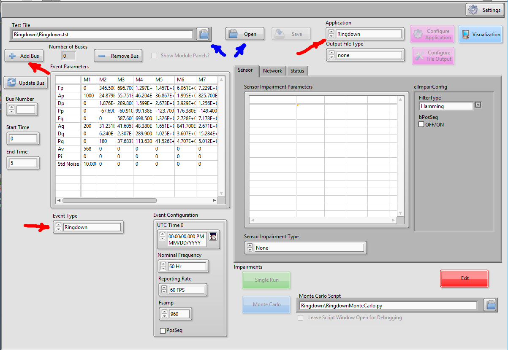
.. |image1| image:: figures/ringdown/media/image2.png
   :width: 4.07445in
   :height: 3.55208in
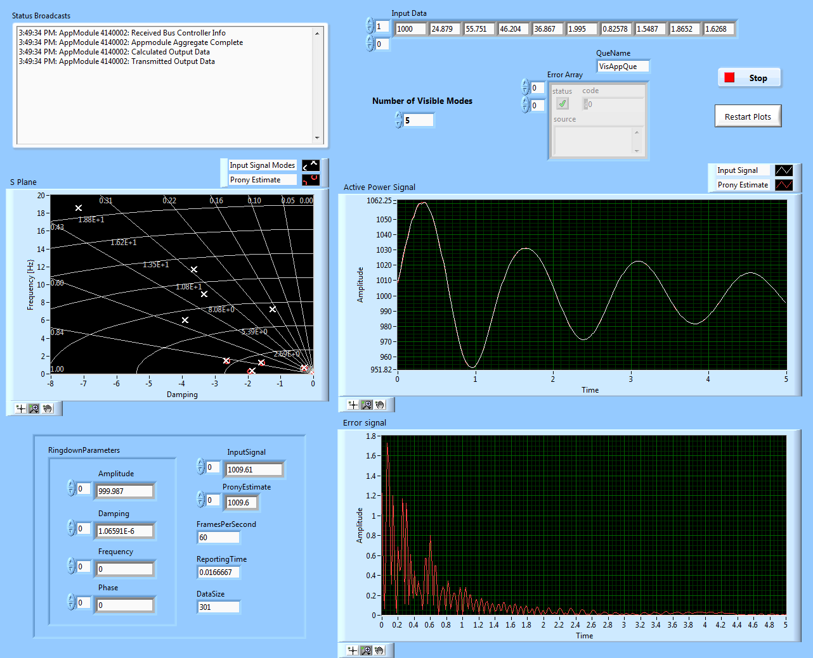
.. |image3| image:: figures/ringdown/media/image4.PNG
   :width: 5.50000in
   :height: 2.97917in
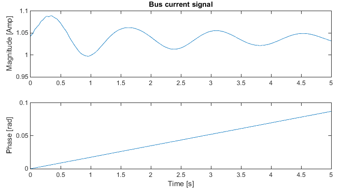
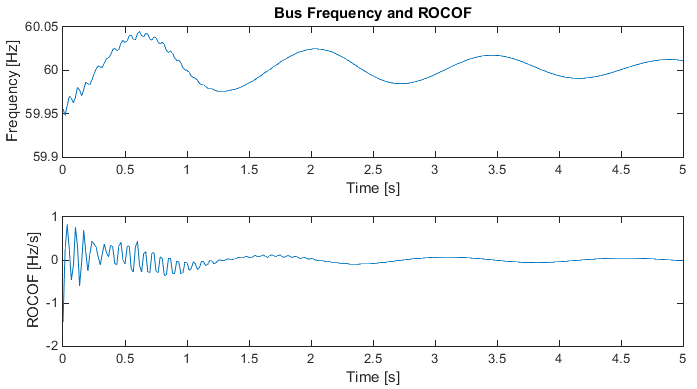
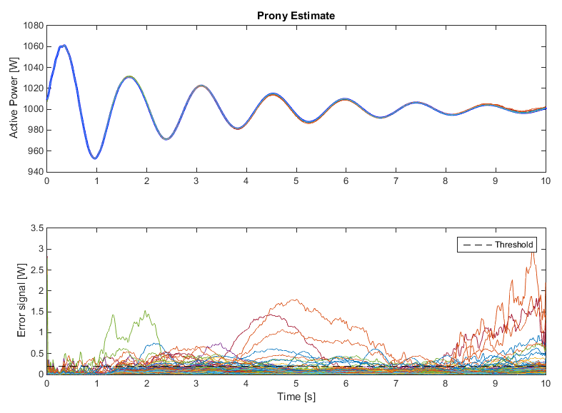
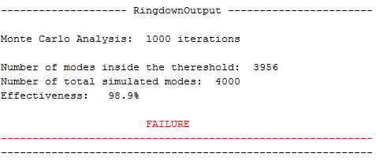
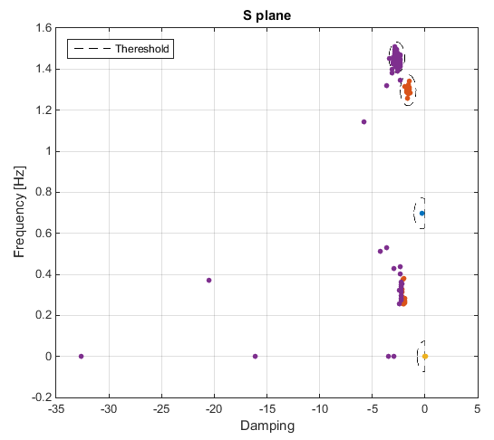
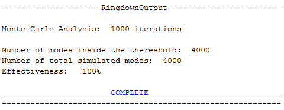
.. |image10| image:: figures/ringdown/media/image11.PNG
   :width: 5.36980in
   :height: 3.85825in
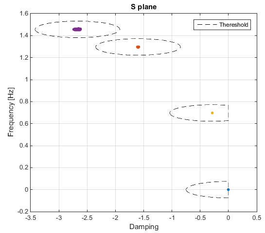
.. |image12| image:: figures/ringdown/media/image13.png
   :width: 0.44792in
   :height: 0.44792in

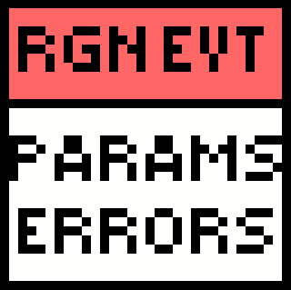
.. |image15| image:: figures/ringdown/media/image16.png
   :width: 4.80764in
   :height: 7.54514in

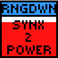

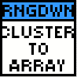
