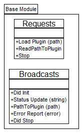
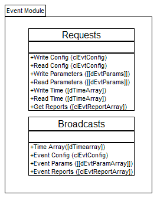

##########################
Module and class diagrams
##########################

A module diagram illustrates the module API. The API consists of the
Requests received by the module and the Broadcasts transmitted by the
module. A class diagram illustrates the properties (also called
“attributes”, “data” or “state”) of the module and methods used to
access the properties.

Base Module
===========

All modules inherit from the Base Module. All modules implement the base
Requests and Broadcasts defined below:

Figure 22: Base Module

Requests
++++++++

Requests are transmitted to a module from the framework. They consist of
a request type and a data type. The requests for the base module are as
follows:

Load Plugin
-----------

The event module uses plugins to create different events. Plugins each
include a mathematical function of time representing a power system
event on a particular bus in the power system. Multiple buses are
represented by instantiating multiple event modules with different event
plug-ins for each instantiation. The Load Plugin request parameter is a
path to an event plugin initialization (.ini) file.

Stop Request
------------

Requests the module to stop and unload from memory.

Broadcasts
++++++++++

The framework and any other module or application can register to
receive broadcasts from a module.

Did Init
--------

Standard output for all modules. Confirms that the module has
initialized

Status Update
-------------

Standard output for all modules. Sends a string informing the framework
of some kind of change in the module’s status with the exception of
errors which are transmitted vi the error report broadcast.

Error Report
------------

Standard output for all modules. On the occurrence of an error in the
module, broadcasts the error cluster.

Event Reports
-------------

Broadcasts an array of structures of ideal PMU data. The structure is as
follows:
* Bus Number (integer)

* UTC Timestamp (double)

* Synchrophasors ([complex double])

* Frequency (double)

* ROCOF (double)

The synchrophasors are a one-dimensional array of complex doubles, each
element represents one phase of voltage or current from the bus
represented by the event module.

Base Plugin Class
=================

All plugin classes inherit from the base plugin class. The class
contains no properties. The methods are as follows:

Figure 23: Base Plugin Class

Methods
+++++++

Create / Destroy
----------------

Methods common to all base classes. Generally, does nothing and are not
overridden unless something special must be done to create and destroy
the objects at runtime.

Implementation Error
--------------------

If a base class must be overridden by a child, this method ensures that
any base class object that is not overridden throws an error.

GetPathToClass
--------------

Plugin children must exist on the hard drive of the system that they are
being instantiated, this method allows a base class to lookup the path
to the class file from the path contained in the child’s .ini file.

LoadClassFromFileOnDisk
-----------------------

Loads the child class from the file pointed to by the path in the
child’s .ini file.

Event Module

Figure 4: Event Module diagram

Requests
++++++++

In addition to the requests inherited from the base module, the event
module supports the following requests:

Write/Read Config
-----------------

The event module configuration data consist of a clConfig structure
containing the UTC T0 (time zero), the PMU reporting Rate (read only),
and the PMU Nominal Frequency.

Write/Read Parameters
---------------------
Event parameters are a two dimensional array of doubles. The meaning of
the rows and columns of the array are dependent on the event plug-in and
are specified in the plug-in’s .ini file.

Write/Read Time
---------------

Time is a vector of time offsets to UTC T0 for which to create the ideal
PMU reports. The time vector is signed, meaning that reports from before
T0 may be created. The read-only PMU reporting rate from the Config
cluster is the mean of the differences between the times in the time
vector.

Get Reports
-----------

Requests broadcast of an array of report clusters. For each element in
the time vector, there will be one element in the array of report
clusters with a timestamp of the UTC T0 plus the value of the time array
element. For details of the report structure data see 6.1.2.4.

Stop Request
------------

Requests the module to stop and unload from memory.

Broadcasts
++++++++++

In addition to the broadcasts inherited from the base module, the event
module supports the following requests:

Time Array
----------

Broadcasts the time vector array of doubles.

Event Config
------------

Broadcasts the event configuration cluster (see 6.2.1.1).

Event Parameters
----------------

Broadcasts the two dimensional array of event parameters (see 6.2.1.2).

Did Stop
--------

Standard output for all modules. Broadcast when the module stops and is
about to unload from memory

Event Plugins
++++++++++++++

Event Plugin Base Class
-----------------------

end Users may create their own plugins. All event plugins inherit from the event plugin base class. 
Most of the methods allow for data to be
written and read to the plugin. It is expected that the GetReports
method will be overridden by each of the event type child classes to
provide reports generated specifically by that event type

.. image:: figures/UML_EventPluginBase.png

Figure 25: Event Plugin Base Class diagram

All event plugin child classes inherit from this base class. The methods
have all been explained in 6.2.1 and 6.2.2

C37.118 Event Plugin
--------------------

TODO:

Event From CSV Plugin
----------------------

TODO:

IEEE Bus System Event
---------------------

TODO:

Ringdown Event
--------------

TODO:

User Events
------------

TODO:

PMU Impairment Module
=====================

.. Image::UML_PmuImpairmentModule.png

Figure 26: PMU Impairment module

Requests
++++++++

In addition to the requests inherited from the base module, the event
module supports the following requests:

Write/Read ImpairConfig
-----------------------

The PMU Impairment module configuration data consists of a
clImpairConfig structure. The elements are TBD at this time.

Write/Read ImpairParams
-----------------------

The impairment parameters are a 2 dimensional array of double that are
defined by the impairment algorithm.

Write EvtReports
----------------

Event reports are generated by the Event module as a array of data
structure clReports. For details of the report structure see 6.1.2.4

GetImpairReports
----------------

Requests an array of PMI Impairment reports in the clReports structure
format. For details of the report structure see 6.1.2.4

Broadcasts
----------

In addition to the broadcasts inherited from the base module, the event
module supports the following requests:

ImpairConfig
------------

Response to the Read ImpairConfig Request. Broadcasts the module’s
clImpairConfig data structure.

ImpairParams
------------

Response to the Read ImpairParam Request. Broadcasts the module’s
clImpairParam two dimensional array of doubles.

ImpairReports
-------------

Response to the getImpairReports Request. Broadcasts an array of
impaired PMU data reports in the clReports structure format. For details
of the report structure see 6.1.2.4

PMU Impairment class
====================

.. image::UML_PmuImpairmentClass

Figure 27: PMU Impairment class

A child of the BasePluginClass. The methods are all described in the preceding sections:

PMU Impairment Plugins
++++++++++++++++++++++

PMU Impairment Base Plugin
--------------------------

TODO:

C37 Behaviour Plugin
--------------------

TODO:

C37 Model Plugin
--------------------

TODO:

Sine Model Plugin
--------------------

TODO:

PMU User Plugin
--------------------

TODO:

Network Impairment Module
=========================

.. image::UML_NetworkModule

Figure 28: Network Impairment Module diagram

Requests
++++++++

In addition to the requests inherited from the base module, the event
module supports the following requests:

Write TimeArray
---------------

TimeArray is a vector of time offsets to UTC T0 which were used to
create the ideal PMU reports. This time vector is the ideal time vector
for which the PMU reports would have been transmitted from the PMU.

Read/Write ImpParams
--------------------

A two dimensional array of doubles make up the network impairment
parameters.

Read/Write LossThreshold
------------------------

The one dimensional array of doubles defines the loss threshold.

GetNetTime
----------

Requests that the Net Time array be broadcast. The Net Time is an
impaired version of the time vector.

GetPktLoss
----------

Requests that the Packet Loss Data be broadcast.

Broadcasts
++++++++++

In addition to the broadcasts inherited from the base module, the event
module supports the following requests:

ImpParams
---------

Response to Read ImpParams request. Broadcasts the two dimensional array
of doubles that are the network impairment parameters.

LossThreshold
-------------

Response to Read LossThreshold request. Broadcasts the one dimensional
array of doubles that are the network Loss Threshold.

NetTime
-------

Response to GetNetTime. Broadcasts the one dimensional array of doubles
which ate the Net Time vector (an impaired version of the Time Array
input to the event module.

PktLoss
-------

Response to GetPktLoss. Broadcasts the two dimensional array of doubles
which are the Packet Loss data.

Network Impairment class
========================

.. image::UML_NetworkClass

Figure 29: Network Impairment Class diagram

The properties and methods for the Network Impairment class have all
been described in 6.4.1 and 6.4.2.

Network Impairment Plugins
++++++++++++++++++++++++++

Network Impairment Base Plugin
------------------------------

Network Plugin
--------------

Flag Impairment Module
======================

PMU reports contain flags which carry information about the data
contained in the PMU report. This module simulates the settings of those
flags similar to the flags found in typical and atypical PMU streams.

.. image::UML_FlagModule

Figure 30: Flag Impairment Module

Requests
+++++++++

Write FlagImpairConfig
-----------------------

A cluster of configuration information for the FlagImpairment module

Write FlagImpairParams
----------------------

A one dimensional array of doubles setting the parameters for the flag
impairment.

Write TimeArray
---------------

The one dimensional array of times from the Event module

GetFlagImpairment
-----------------

Requests broadcast of the one dimensional array of 32-bit unsigned
integers which represent the impaired status flags

Broadcasts
++++++++++

FlagImpairment
--------------

Response to GetFlagImpairment (). Broadcasts a one dimensional array of
32-bit unsigned integers which represent the impaired status flags

Flag Impairment Plugin class
============================

This class is a pluggable class. The two child classes will be the
C37.118 Flag Impairment class and the IEC 61850 Flag Impairment class.

.. image::UML_FlagClass.png

Figure 31: Flag Impairment Plugin Class

The attributes and methods of the FlagImpairment class have all been
described in 6.5

Output to File Module
=====================

The module receives ideal PMU reports from the event module, impaired
PMU reports from the PMU Impairment module and Network Time and Packet
Loss data from the Network Impairment module and prepares the data for
output to a file format determined by the plug-in for the module.

.. image::UML_OutToFileModule.png

Figure A‑32: Output to File Module

Requests
++++++++

In addition to the requests inherited from the base module, the event
module supports the following requests:

Write OutputToFilePluginIniPath
--------------------------------

Writes the path to the plugin’s .ini file and loads the plugin.

Read OutputToFilePluginIniPath
------------------------------

Reads the path to the plugin’s .ini file.

Write/Read OutputPath
---------------------

The top level path to where the output files will be placed.

Write/Read ConfigOptions
-------------------------

This is the configuration of the PMU which will be used in the output
file

Write NetTime
-------------

A one dimensional array of doubles generated by the network impairment
module is an impaired version of the time vector used to generate the
ideal and impaired PMU reports.

Write PktLoss
-------------

A one dimensional array of doubles generated by the Network Impairment
module used to mark data written to the output file as lost.

Write FlagImpairArray
---------------------

A one dimensional array of Int32 representing the PMU flags from the
Flag Impairment Module.

OutputReferenceFile
--------------------

Requests the module to write the file of reference (ideal) output data
in the format determined by the plugin.

OutputImpairedFile
------------------

Requests the module to write the file of impaired output data in the
format determined by the plugin.

OutputErrorData
---------------

Requests the module to write the error data (TVE, ME, PE, FE, RFE) for
output to an error file.

Broadcasts
++++++++++

In addition to the requests inherited from the base module, the
broadcasts are:

OutputToFilePluginIniPath
-------------------------

Path to the plugin’s .ini file

OutputPath
----------

Path to the top level directory where the output files will be written

ConfigOptions
--------------

The cluster of PMU configuration options

Output to File base plugin class
--------------------------------

A plugin class where the children of the class each output to a
different file format. Example file formats are C37.118.2 csv,
WECC-JSIS, and Comtrade.

.. image::OutToFileClass

Figure A‑33: Output to File class

The properties and methods for the Network Impairment class have all
been described in 6.6.1
