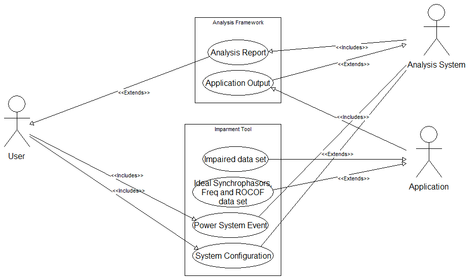

########
Use case
########

The use case is diagrammed in Figure 2.

Figure 2 Use Case
 
Actors
======

The use case actors (the stick people in Figure 2) are the user, The application which accepts PMU data, and an analysis system which may be a person, user provided software, or both.  For each application, the analysis system will need to be custom designed.

User
====

The user determines the System Configuration and the Power System Event(s) by developing an initialization (.ini) file which is imported to the Impairment Tool framework.  The user can also develop test automation scripts, plugins, and additional analysis software.

Application
===========

The application is software which uses sensor data as input.  The data input and output formats are specific to the application so the framework and the modules that are supported by the framework will use application specific plug-ins to convert data formats to and from the internal data format used by the framework.

The application receives ideal and impaired synchrophasor, frequency, ROCOF, and timestamp data from the framework.

Analysis System
===============

The analysis system involves a human who is an expert on the application.  The Expert will be involved in the development of application-specific analysis software which can be supported by the framework or may stand alone.

The analysis system receives impairment framework configuration, ideal and impaired event data, impairment parameters, and data from the application either by listening to module broadcasts or by reading output data files.  This information is analyzed by comparing the application output using ideal data to application output using impaired data.  The comparison may produce a "figure of merit" which can be plotted in a multi-dimensional error parameter space.  By determining which figures of merit are considered acceptable application output and which are unacceptable outputs, a multi-dimensional error parameter surface determines the worst-case PMU error which will produce an acceptable application error.